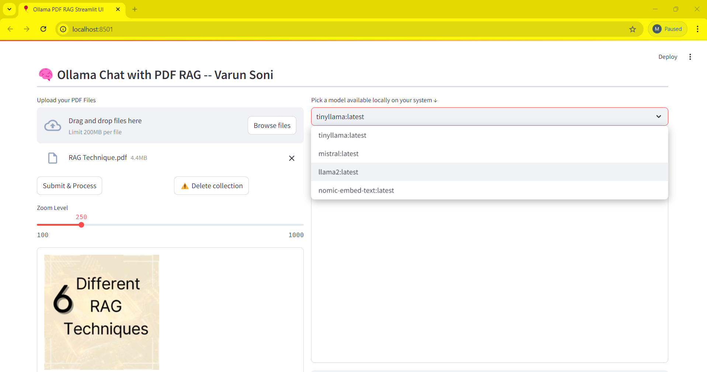
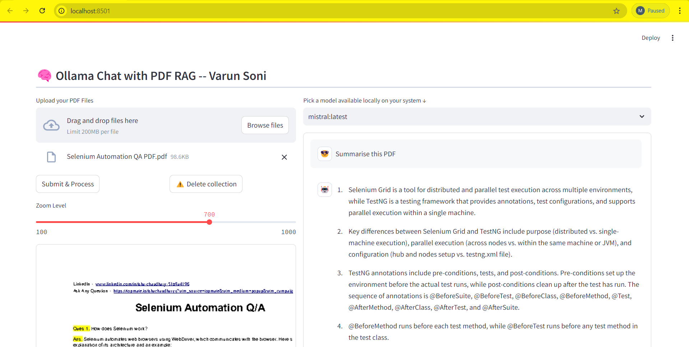
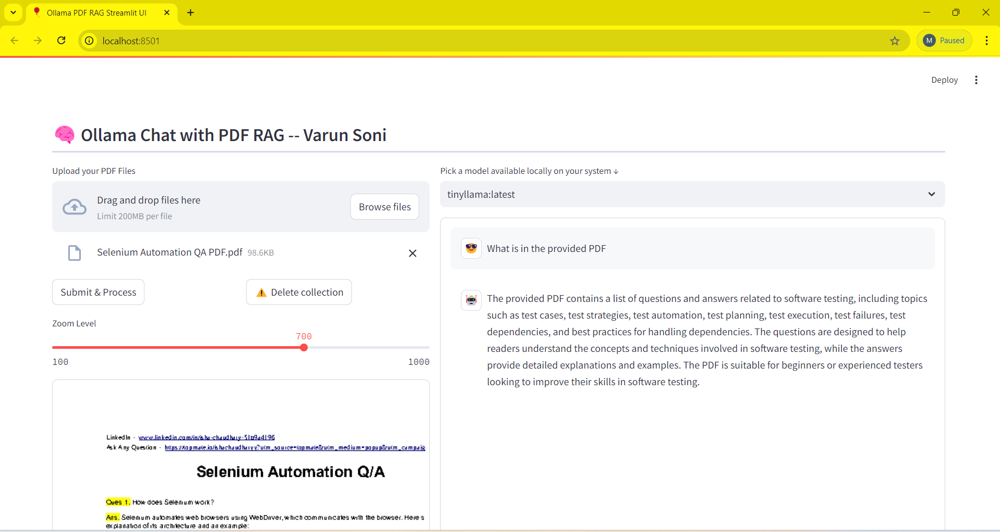

# QueryCore (PDF Chat with Ollama + FAISS)

QueryCore is a Streamlit app for asking natural-language questions about your PDF files using a local Ollama model + embeddings + FAISS retrieval.

Created by Vedant Navadiya.

## Screenshots







## Features

- Upload and process one or more PDFs
- Local LLM answering via Ollama (privacy-friendly)
- Retrieval-Augmented Generation (RAG) with FAISS vector search
- Multi-query retrieval to improve recall
- Built-in PDF viewer with zoom

## Tech Stack

- UI: Streamlit
- Parsing: PyPDF2, pdfplumber (page image previews)
- Embeddings: `nomic-embed-text` via `langchain-ollama`
- Vector store: FAISS
- LLM: any Ollama chat model available locally (e.g., `mistral`, `tinyllama`)

## Prerequisites

- Windows/macOS/Linux
- Python 3.10+ recommended
- Ollama installed and running: https://ollama.com/

## Setup (Windows PowerShell)

1. Create and activate a virtual environment:

   ```powershell
   python -m venv .venv
   .\.venv\Scripts\Activate.ps1
   ```

2. Install dependencies:

   ```powershell
   pip install -r requirements.txt
   ```

3. Pull Ollama models (pick what you want to use):

   ```powershell
   ollama pull nomic-embed-text
   ollama pull mistral
   ollama pull tinyllama
   ```

   Notes:
   - `nomic-embed-text` is used for embeddings.
   - The app will list your locally available Ollama models in the dropdown.

## Run

1. Start Ollama (if it’s not already running).

2. Run the Streamlit app:

   ```powershell
   streamlit run app.py
   ```

3. Open the URL Streamlit prints (usually http://localhost:8501).

## Usage

1. Upload PDF file(s)
2. Click “Process PDF(s)”
3. Select a model and ask questions in the chat

## Repo Notes

- `faiss_index/` is created locally after processing PDFs and is intentionally not committed.
- The included `rag-ollama/` directory (if present) is a local virtual environment and is intentionally not committed.

## Troubleshooting

- If the model list is empty, confirm Ollama is running and has models installed (`ollama list`).
- If you see FAISS install issues, ensure you are using `faiss-cpu` (this repo does not use `faiss-gpu`).
